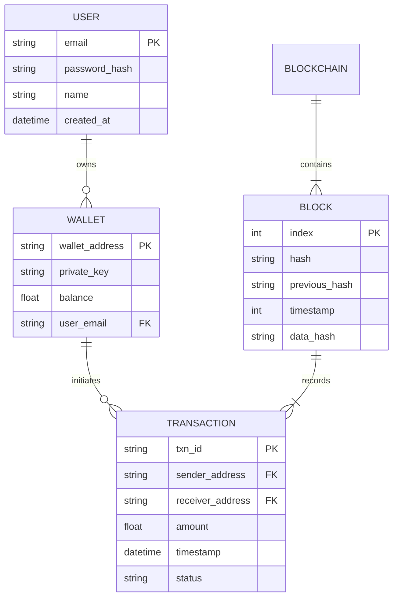
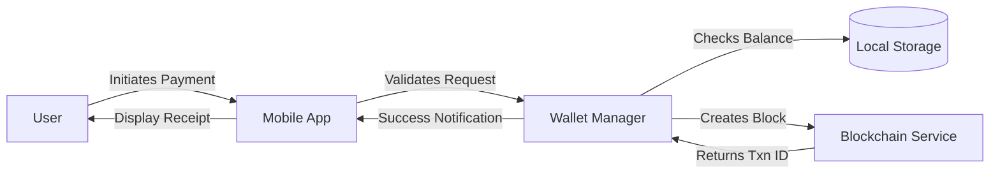

# System Diagrams

## 1. Use Case Diagram

```mermaid
usecaseDiagram
    actor User as "Wallet User"
    actor Admin as "System Admin"
    participant App as "Flutter App"
    participant BC as "Blockchain Ledger"

    User --> (Register/Login)
    User --> (View Balance)
    User --> (Send Money)
    User --> (Scan QR Code)
    User --> (View History)

    (Send Money) ..> (Validate Balance) : include
    (Send Money) --> BC : "Record Transaction"
    
    Admin --> (Monitor Network)
    Admin --> (Manage Users)
```

## 2. Entity Relationship Diagram (ERD)

Although this is a blockchain system, we represent the logical data structure below.



## 3. Data Flow Diagram (Level 0)


